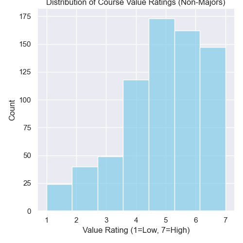
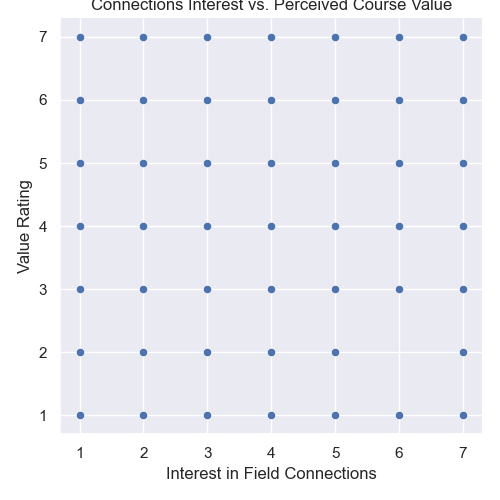
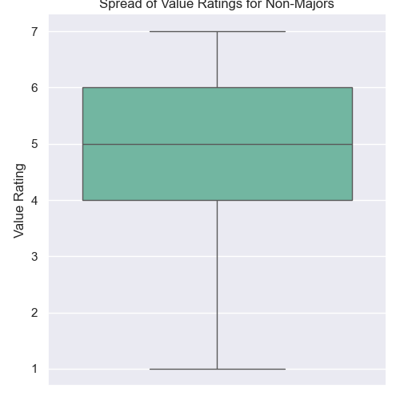

---
# Do not edit the text between these lines!
layout: default
---

# Data Analysis: Boosting Course Value for Non-Majors

I’m constantly looking at how we can make technical learning more relevant for students who don't necessarily see themselves as coders. For this analysis, I used survey data from COMP110 to see if adding more real-world, interdisciplinary examples would help justify learning programming for students outside the Computer Science major.

## Analysis Summary
My analysis focused specifically on the Non-Major stakeholder group. I wanted to see if there was a connection between a student's interest in how CS relates to other fields and how much they actually valued the course skills. Using Python and seaborn, I filtered the class data to isolate these students and plotted their responses to identify where we might be losing their engagement.

## Visualizations

### 1. Perceived Value Distribution
First, I looked at how non-majors currently rate the value of the course. While many see the benefit, there is a significant cluster in the neutral range.

### 2. Interest vs. Perceived Value
Next, I checked for a correlation. This scatterplot shows that students who are more interested in interdisciplinary connections generally feel the course is more valuable to their future.

### 3. Statistical Spread of Sentiments
Finally, this boxplot shows the overall spread of ratings. While the median is high, the whiskers show a wide variety of opinions, proving there is room for improvement.

---

## Final Conclusions

After digging through the data, it’s clear that for non-CS majors, seeing how programming works in other fields makes a big difference. The analysis showed a solid link where the more someone was interested in interdisciplinary connections, the more they felt the course was valuable. Most non-majors seem to get a lot out of it, but since there are still neutral ratings, adding more real-world applications could really show them why these skills matter.

The main trade-off is just how much time we have in class. If we spend more time on applications like biology or economics, we’ll have to trim down some of the deeper technical content. This might be a downside for the hardcore CS majors who want that extra depth. It’s a tough balance to keep the class relevant for everyone without losing the rigor that future software engineers need.

To take this further, we could look at which specific majors are most common among the non-CS students and pick examples that fit them. If we have a lot of bio or econ students, using data from those fields for projects would make the lessons hit home. Showing them exactly how programming solves problems in their own world would turn those neutral ratings into high ones by proving code is a powerful tool for any career.